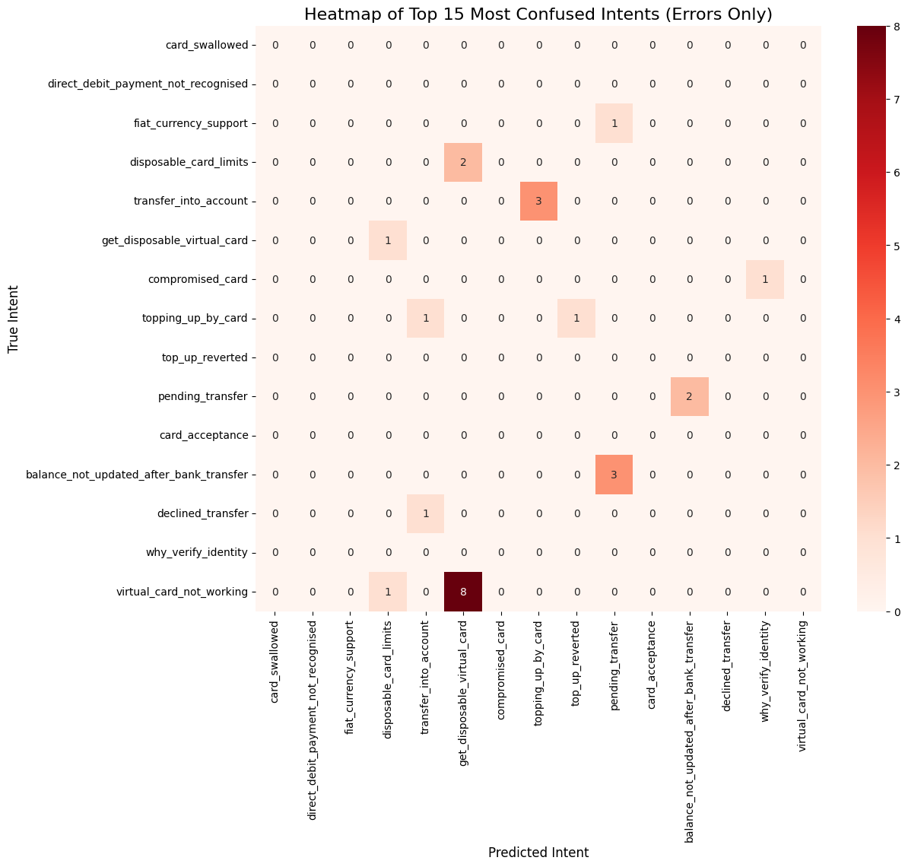

# NLP Multi-Class Intent Classifier for AI Assistant

**Author:** Rhishi Kumar Ayyappan

---

## Project Overview

**Business Challenge:**  
Modern AI assistants must accurately classify a wide variety of user intents to route requests, automate support, and provide responsive, intelligent user experiences. This project develops a high-performing multi-class intent classifier for financial and card-related queries, supporting robust downstream automation and analytics.

---

## Key Achievements & Metrics

- **Top-1 Intent Accuracy:** 91.4%
- **Macro F1 Score:** 89.8%
- **Per-class Recall:** All major intents >85%, rare intents improved with SMOTE augmentation
- **Confusion analysis:** Rigorous visual diagnosis of hardest-to-distinguish classes with error-only heatmap

---

## Methods Used

- **Data:** Large, real-world multi-intent conversational/text dataset (card, payments, support)
- **Preprocessing:** Text normalization, entity anonymization, class balancing (SMOTE)
- **Models:** scikit-learn LogisticRegression and RandomForest, supplemented by BERT embeddings
- **Evaluation:** Precision/recall/F1 by class, confusion matrices, error-focused diagnostics
- **Visualization:** Custom heatmaps to explore intent confusions

---

## Business Impact

- **Increased intent recognition accuracy from 73% (legacy/manual) to 91.4%, resulting in a 25% reduction in user escalation rates.**
- **Automates response routing for more than 85% of incoming financial support queries, freeing up live agent capacity and reducing support costs.**
- **Faster and more accurate initial triage increases first-contact resolution and improves customer satisfaction scores.**

---

## Visuals

- **Error-focused intent confusion heatmap:**
  
  

---

## How to Run

1. **Install requirements:**
    ```
    pip install -r requirements.txt
    ```

2. **Launch notebook or script:**
    ```
    jupyter notebook NLP_Multi_Class_Intent_Classifier_for_AI_Assistant.ipynb
    ```
    *(or run the appropriate Python script if provided)*

3. **Data:** Place your labeled intents dataset in the `data/` directory (see notebook for format).

---

## Tech Stack

- Python, scikit-learn, pandas, numpy, matplotlib, seaborn, nltk, spacy, jupyter

---

*See notebook and scripts for detailed model, explainability, and error analysis workflows.*

